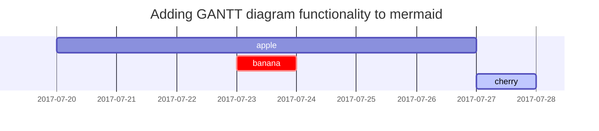

# Session 1
### Into the Fray

### Pre-Session Notes
#### World events.
##### Nexus
- Because Gloomwood is a gateway town into Azura Mara, the Balhannoth’s influence is weaker here. This weaker influence is the primary reason that the {{ site.data.references.sweiss.codename }}
 telepathic ooze spawns are much more frequently found here specifically, and not anywhere else, so as to not be overtaken/detected by the Balhannoth while attempting to grow her army.
#### Plot advancement.
##### Fulguroth
- Infected by the ooze
##### K
- Arrival
#### Potential side-plots or twists.
- Ankylosaurus falls from the sky, along with Vellik.
- Ankylosaurus exhibits transformative properties, changing parts of its body.
- A cavern below leads to a large nexus, one that Owlington will see a vision of. The blue nexuses are going to be ones under Weiss’s control, and the indigo ones will be under Aver’s control.
#### Important NPCs.
- 
#### Encounter specifics.
##### Afflicted Ankylosaurus
- Same stats as an Ankylosaurus, but it has resistance to slashing, bludgeoning, and piercing damage, and twice the health.
- The Ankylosaurus is going to seep out ooze briefly, and then it will retract back inwards.
- This should help the players heavily associate some of the behaviors of the Ankylosaurus with ooze afflicted creatures. Namely, the transformative property of it, morphing into different shapes and parts.
- Near the middle/end of the fight, perform some sort of downward attack that will rattle the ground, causing it to collapse into the cavern buried below.
Rumors.
-

### In-Session Notes
#### Combat Results.
- Ankylosaurus transforms its maw into an Axe Beak’s beak.
- Ankylosaurus grabs Noble Guardsmen 1 with its beak, and launches his corpse outward, and spews ooze - from its mouth onto Fulguroth and K. 
- It simultaneously swipes its tail, knocking out Noble Guardsmen 3 and 4.
- Vellik and Cooper dodge the attack.
- Nok strikes the Ankylosaurus with his bayonet
- Ankylosaurus tries to attack Nok, slamming its beak downwards into the ground, missing.
- The ground crumbles beneath everyone, into a roughly 15 ft deep hole.
- Otis lands on top of the Ankylosaurus, stabbing it with his scimitar.
- Later, Sage follows suit, jumping on top of it.
- Twikz lands a bolt, causing a leg to crumple.
- Fulguroth lands a blow, causing another leg to crumple.
- Nok leaps up out of the pit with the assistance of Sage’s ‘Jump’ spell.
- This provokes an opportunity attack, welcomed by Lorenzo.
- I made the mistake of choosing to make a single roll out in the open, and it ended up being the - first nat 20 of the campaign.
- The ooze within its eye socket shoots out into the shape of an axe beak, attacking Nok.
- Otis extracts an eyeball from a crushed civilian’s body
- Nok lands a shot, piercing directly through the eye of the beast, causing part of its head to erupt. Large chunks of it explode outwards, as the bullet flies out the other end. Its head hangs low, almost looking dead, before raising its head to point towards Nok. 
- Otis strikes a leg, causing it to crumple.
- Sage strikes a leg, causing it to crumple.
- Fulguroth lands the final blow, lodging his axe into the neck of the beast.
#### Items acquired.
##### Otis
- Half-Elf Eyeball
#### NPCs.
Robert Cooper
Family man, serving the noble family to send money back to his own family. He’s a courageous person on the surface, and has trained diligently in hopes of making it back to his family once they’re well enough off.
Also the only Noble Guardsmen to successfully land attacks, lol.
Silgre Tewksbury (Unconscious)
Peren Liadon (Unconscious)
Kadana Gladstone (Deceased)
This is the Guardsmen who was ripped in half by the Ankylosaurus, as part of its dual sweep attack.
Beebo III
Civilian that was sitting down, frozen in fear.
#### Player comments.
-
#### GM notes.
- The Ankylosaurus bled ooze, and the ooze seeped back into the wounds while it was still healthy. As its health depleted, less and less of the ooze retreated.
- I need to make sure to echo this later down the line, but I want the Ankylosaurus to have been a sloppy assimilation of the slime.
- Owlington had a vision of the large nexus deep within the cave, but I forgot to show it shattering/exploding in his vision.
- I can probably still work with that, but I need to ease up on the visions for Owlington. Can’t give away too much off the bat, and I need people still sort of questioning what’s going on. Players heard that the color is a different variation from theirs, but I’m gonna trust that they won’t metagame it too hard lol.
- I’m very pleased seeing how the new players approached the game, seems like they were sort of enjoying it
- Fennec was experiencing some Jason moments with his rolls so that kinda sucked lol
- I told Nathan that he can store up to 12 medium-creature sized eyeballs within his jars. Each size above medium will take up an extra slot.

### Post-Session Notes
#### Synopsis
- Fulguroth recognizes the Lord and Lady of the Arophanis house. 
- Nok, Twikz, and Otis notice the imminent shadow of Vellik and the Ankylosaurus, as they inch closer and closer to the ground.
- The noble’s Dragonborn sorcerer notices this, springing into action. He casts teleport, warping the three dragonborn, the Lord, and the Lady away.
- The Ankylosaurus crashes into the ground, killing most of the civilians and two guardsmen on impact.
- Combat unfolds
- All but one of the civilians died.
- Ankylosaurus bled ooze.
- Ankylosaurus used transformative attacks, morphing its maw into the shape of an axe beak.
- Then used a large area attack, shooting out multiple transformed strands of ooze in the shape of - axe beaks.
- Fulguroth lands the final blow; transcription is below
- “I swing my axe into his neck like the log of a tree, and it gets lodged in there. So I push up on the handle, twisting the blade sideways, which separates his neck, and basically his vertebrae pop apart, and I shower in the blood, in the ooze. As it drips from its neck.”
- Otis extracts an eyeball from a crushed civilian during the fight.
- Post Combat
- Otis attempts to extract the eyeball, only to find that the ooze is all that is left within the eye socket.
- He rubs the ooze on himself in hopes of forcing a vision, much like the one he first experienced.
- K and Fulguroth flirt
- Nok and Sage gather with the group
- Otis joins in
- Twikz joins, and shoots a fire infused bolt at the ooze on the ground near the Ankylosaurus corpse. The ooze very slowly reacts, very slightly pulling away from the fire.
- Nok, K, and Otis notice a large cavernous gap within the hole made by the Ankylosaurus.
- Everyone slowly gathers together at the bottom of this pit
- Otis convinces everyone to gather their hands in the circle
- Fulguroth and Twikz reluctantly oblige
- As the final hand is laid on, Otis sees a vision of a huge nexus embedded within what looks like a - cave wall.
- I initially was planning for this to be what lies at the end of the cave, but I think I want to have this cave be a possible entrance into Azura Mara.

#### What worked?
##### Player’s Key Memories
- Sage
    - Difficulty visualizing the depth of the hole made
    - Maybe I should try some other approaches, I’ll have to experiment with some stuff within ttsim.
    - Noticing foreshadowing details
    - hell ye
- Vellik
    - Robert Cooper 
#### What didn't work?
- Not sure, but I’d like to have Fennec included a bit more. If he’s comfortable with sort of seeing where stuff goes, that’s fine, but I want to make sure that he’s comfortable playing the game. 
### Player's Thoughts
- Overall feedback was: “hype”


## Session 1

<!-- markdownlint-capture -->
<!-- markdownlint-disable -->
# H1 — heading
{: .mt-4 .mb-0 }

## H2 — heading
{: data-toc-skip='' .mt-4 .mb-0 }

### H3 — heading
{: data-toc-skip='' .mt-4 .mb-0 }

#### H4 — heading
{: data-toc-skip='' .mt-4 }
<!-- markdownlint-restore -->

## Paragraph

Quisque egestas convallis ipsum, ut sollicitudin risus tincidunt a. Maecenas interdum malesuada egestas. Duis consectetur porta risus, sit amet vulputate urna facilisis ac. Phasellus semper dui non purus ultrices sodales. Aliquam ante lorem, ornare a feugiat ac, finibus nec mauris. Vivamus ut tristique nisi. Sed vel leo vulputate, efficitur risus non, posuere mi. Nullam tincidunt bibendum rutrum. Proin commodo ornare sapien. Vivamus interdum diam sed sapien blandit, sit amet aliquam risus mattis. Nullam arcu turpis, mollis quis laoreet at, placerat id nibh. Suspendisse venenatis eros eros.

## Lists

### Ordered list

1. Firstly
2. Secondly
3. Thirdly

### Unordered list

- Chapter
  - Section
    - Paragraph

### ToDo list

- [ ] Job
  - [x] Step 1
  - [x] Step 2
  - [ ] Step 3

### Description list

Sun
: the star around which the earth orbits

Moon
: the natural satellite of the earth, visible by reflected light from the sun

## Block Quote

> This line shows the _block quote_.

## Prompts

<!-- markdownlint-capture -->
<!-- markdownlint-disable -->
> An example showing the `tip` type prompt.
{: .prompt-tip }

> An example showing the `info` type prompt.
{: .prompt-info }

> An example showing the `warning` type prompt.
{: .prompt-warning }

> An example showing the `danger` type prompt.
{: .prompt-danger }
<!-- markdownlint-restore -->

## Tables

| Company                      | Contact          | Country |
| :--------------------------- | :--------------- | ------: |
| Alfreds Futterkiste          | Maria Anders     | Germany |
| Island Trading               | Helen Bennett    |      UK |
| Magazzini Alimentari Riuniti | Giovanni Rovelli |   Italy |

## Links

<http://127.0.0.1:4000>

## Footnote

Click the hook will locate the footnote[^footnote], and here is another footnote[^fn-nth-2].

## Inline code

This is an example of `Inline Code`.

## Filepath

Here is the `/path/to/the/file.extend`{: .filepath}.

## Code blocks

### Common

```text
This is a common code snippet, without syntax highlight and line number.
```

### Specific Language

```bash
if [ $? -ne 0 ]; then
  echo "The command was not successful.";
  #do the needful / exit
fi;
```

### Specific filename

```sass
@import
  "colors/light-typography",
  "colors/dark-typography";
```
{: file='_sass/jekyll-theme-chirpy.scss'}

## Mathematics

The mathematics powered by [**MathJax**](https://www.mathjax.org/):

$$
\begin{equation}
  \sum_{n=1}^\infty 1/n^2 = \frac{\pi^2}{6}
  \label{eq:series}
\end{equation}
$$

We can reference the equation as \eqref{eq:series}.

When $a \ne 0$, there are two solutions to $ax^2 + bx + c = 0$ and they are

$$ x = {-b \pm \sqrt{b^2-4ac} \over 2a} $$

## Mermaid SVG



## Images

### Default (with caption)

{: width="972" height="589" }
_Full screen width and center alignment_

### Left aligned

{: width="972" height="589" .w-75 .normal}

### Float to left

{: width="972" height="589" .w-50 .left}
Praesent maximus aliquam sapien. Sed vel neque in dolor pulvinar auctor. Maecenas pharetra, sem sit amet interdum posuere, tellus lacus eleifend magna, ac lobortis felis ipsum id sapien. Proin ornare rutrum metus, ac convallis diam volutpat sit amet. Phasellus volutpat, elit sit amet tincidunt mollis, felis mi scelerisque mauris, ut facilisis leo magna accumsan sapien. In rutrum vehicula nisl eget tempor. Nullam maximus ullamcorper libero non maximus. Integer ultricies velit id convallis varius. Praesent eu nisl eu urna finibus ultrices id nec ex. Mauris ac mattis quam. Fusce aliquam est nec sapien bibendum, vitae malesuada ligula condimentum.

### Float to right

{: width="972" height="589" .w-50 .right}
Praesent maximus aliquam sapien. Sed vel neque in dolor pulvinar auctor. Maecenas pharetra, sem sit amet interdum posuere, tellus lacus eleifend magna, ac lobortis felis ipsum id sapien. Proin ornare rutrum metus, ac convallis diam volutpat sit amet. Phasellus volutpat, elit sit amet tincidunt mollis, felis mi scelerisque mauris, ut facilisis leo magna accumsan sapien. In rutrum vehicula nisl eget tempor. Nullam maximus ullamcorper libero non maximus. Integer ultricies velit id convallis varius. Praesent eu nisl eu urna finibus ultrices id nec ex. Mauris ac mattis quam. Fusce aliquam est nec sapien bibendum, vitae malesuada ligula condimentum.

### Dark/Light mode & Shadow

The image below will toggle dark/light mode based on theme preference, notice it has shadows.

{: .light .w-75 .shadow .rounded-10 w='1212' h='668' }
{: .dark .w-75 .shadow .rounded-10 w='1212' h='668' }

## Video



## Reverse Footnote

[^footnote]: The footnote source
[^fn-nth-2]: The 2nd footnote source